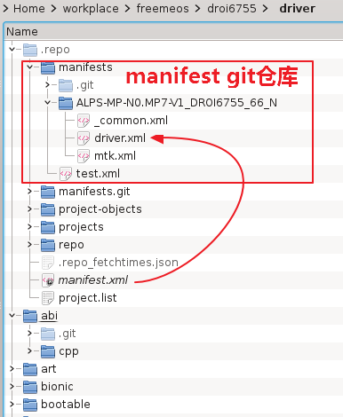
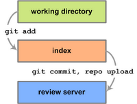
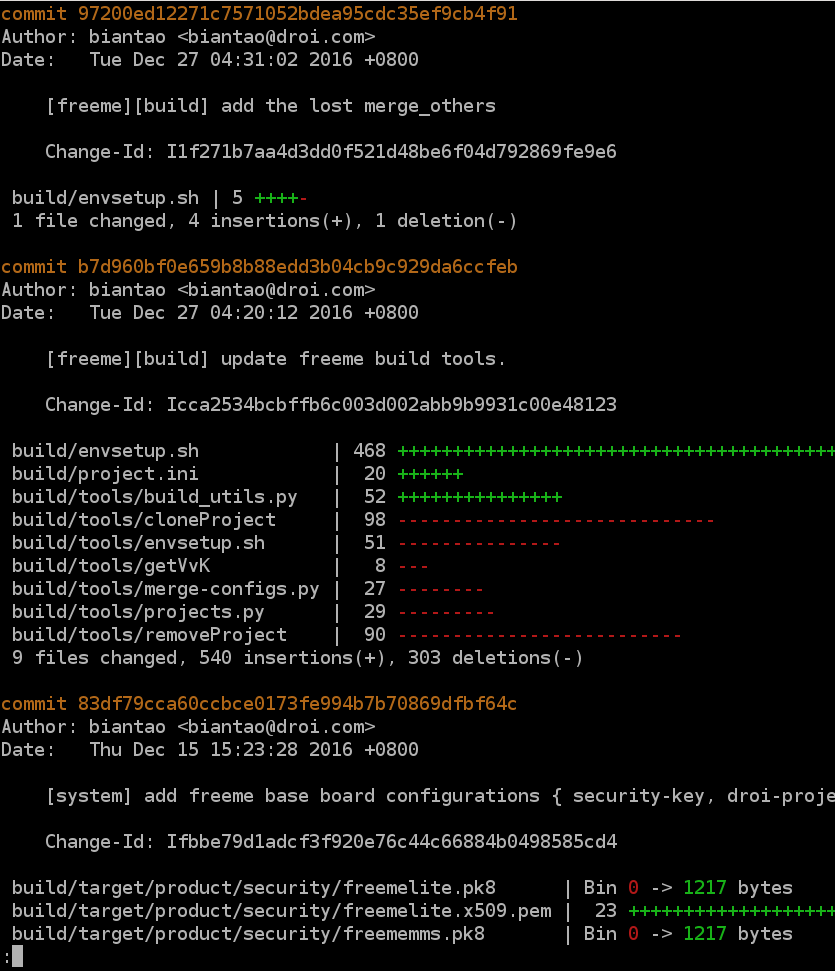

# repo仓库

## 下载代码

下载一个Repo项目，只需要三条命令：
```
$ repo init --no-repo-verify -u <URL> -m <manifest-file>
$ repo sync
$ repo start --all master
```

`repo init`中的使用到参数含义如下：
- `-u`：指定manifest仓库的路径，这是一个git仓库地址
- `-m`：指定manifest仓库中的某个manifest文件

例如，下载AndroidN 50项目驱动版本，命令如下：

```
$ repo init --no-repo-verify ssh://yourname@10.20.40.19:29418/freemeos/manifest -m ALPS-MP-N0.MP7-V1_DROI6755_66_N/mtk.xml 
$ repo sync
$ repo start --all master
```

## 什么是repo？

repo有多重含义，这里明确说明下，以免混淆。
- 版本管理工具所谓的`仓库`，对应英文`repository`，缩写为`repo`。一个git仓库，英文即git repo。
- 整个Android源码树由500个左右的git仓库构成。为了方便管理，Google开发了`repo`工具（使用python语言开发），并且以特殊的目录结构组织Android源代码。有时候，采用这种方式构成的大项目（或称为大仓库）也被称为`Repo`。

## 什么是manifest文件

manifest文件即Repo工程的描述文件，XML格式，其中描述 **该Repo工程由哪些git仓库构成，且各个git子仓库以放置在哪个目录下。**

manifest文件本身也保存在一个git仓库中，这个特殊的仓库也就是所谓`manifest`仓库。当使用`repo`脚本下载`Repo`仓库代码时，需要明确告诉repo名命令使用哪个manifest仓库中哪个manifest文件下载代码。

## `Repo`的组织方式

Google设计的Repo项目的组织结构如下图，以AndroidN 50驱动版本为例（标准Android的目录结构类似）：



`.repo`目录结构
- manifest. 这是一个git仓库，repo命令的`-u`参传入的url被repo脚本使用`git clone`到此处。
- manifests.git
- project.list
- project-objects。
- projects
- repo. repo工具的具体实现。
- manifest.xml. 当前Repo的工程描述文件，该文件是个软连接，指向manifest/下的某个文件。

# 项目开发

## 基本工作流程

1. 同步服务器最新代码
    - repo sync
2. 修改源代码
3. 使用git命令在本地提交
    - git add，暂存修改
    - git commit，提交到本地
4. 上传提交
    - repo upload，讲本地的提交上传到代码审核服务器（也就是gerrit）
5. 代码审核（code review）
    - 主管或高级工程师进行code review
    - 确认实现无问题，主管将修改提交到代码仓库



## 同步代码

同步所有项目代码到本地。
```
$ repo sync
```
只同步某些项目
```
$ repo sync PROJECT0 PROJECT1 PROJECT2 ...
```

一般执行`repo sync`。

## 本地代码修改与提交

### git简介


### 记录每次更新到仓库

#### 检查当前文件状态

```
$ git status
```

#### 跟踪新文件或暂存被修改的文件

```
$ git add
```

如果被修改的文件很多，要将他们全部加入暂存，可以使用

```
$ git add -u
```

如果要跟踪或暂存某个目录所有文件，可以使用
```
$ git add you-dir
```

#### 忽略文件（.gitignore)

一般总会有些文件无需纳入`Git`的管理，也不希望它们总出现在未跟踪文件列表。 通常都是些自动生成的文件，比如日志文件，或者编译过程中创建的临时文件等。 在这种情况下，我们可以创建一个名为`.gitignore`的文件，列出要忽略的文件模式。

```
$ cat .gitignore
*.[oa]
*.swp
build/
```
- 第一行告诉`Git`忽略所有以`.o`或`.a`结尾的文件。一般这类对象文件和存档文件都是编译过程中出现的。
- 第二行告诉`Git`忽略所有以swp结尾的文件，这是vim生成的临时文件。
- 第三行告诉`Git`忽略`build/`

添加到.gitignore文件之后，`git status`和`git add`就会忽略他们。

### 提交更新（提交到本地git仓库）

现在的暂存区域已经准备妥当可以提交了。 在此之前，请一定要确认还有什么修改过的或新建的文件还没有`git add`过，否则提交的时候不会记录这些还没暂存起来的变化。 这些修改过的文件只保留在本地磁盘。 所以，每次准备提交前，先用 `git status`看下，是不是都已暂存起来了， 然后再运行提交命令`git commit`：
```
$ git commit
```
这种方式会启动文本编辑器以便输入本次提交的说明。 (默认会启用`shell`的环境变量`$EDITOR`所指定的软件，一般都是`vim`或`emacs`。一般使用`git config --global core.editor`命令设定你喜欢的编辑软件。）


另外，也可以在`commit`命令后添加`-m`选项，将提交信息与命令放在同一行，如下所示：
```
$ git commit -m "Story 182: Fix benchmarks for speed"
[master 463dc4f] Story 182: Fix benchmarks for speed
 2 files changed, 2 insertions(+)
 create mode 100644 README
```

请记住，提交时记录的是放在暂存区域的快照。 任何还未暂存的仍然保持已修改状态，可以在下次提交时纳入版本管理。 每一次运行提交操作，都是对你项目作一次快照，以后可以回到这个状态，或者进行比较。

### 查看历史

查看提交历史使用
```
$ git log
```

默认不用任何参数的话，`git log`会按提交时间列出所有的更新，最近的更新排在最上面。这个命令会列出每个提交的 SHA-1校验和、作者的名字和电子邮件地址、提交时间以及提交说明。

`git log`有许多选项可以帮助查找需要的提交。简单介绍一下最常见的几个参数。

- `-p`：显示每次提交的内容差异
- `-数字`：显示最近几条提交

例如`git log -p -2`显示，最近两条提交，并且给出每条提交内容差异

- 查看每次提交的简略的统计信息，可使用`--stat`选项
- 查看某个文件上的所有改动，使用`git log the-file-you-want-watch`
- 查看某个文件夹内的所有改动，使用`git log the-dir-you-want-watch`
- 查看某人的所有改动，使用`--author="xxxx"`选项

注意，上面的选项可以组合使用，例如查看某个文件夹内某人的改动，并且给出简略的统计信息，以及内容差异

```
$ git log --stat --author=biantao build
```



初次之外，git log还有很多强大参数，比如列出某短时间内，后者以特定格式显示提交历史。不展开了。

### 撤销修改

* git commit --amend
* git checkout
* git reset
### 冲突修复

## 上传提交
* repo upload
## 总结

## 参考文献

# 附录，repo/git命令

## `repo`命令

repo命令可以在Repo仓库目录及其任意子目录下执行，不需要在Repo根目录下执行。

### `repo init`

```
$ repo init -u <URL> [<OPTIONS>]
```

在当前目录下安装Repo仓库。执行完毕后在当前目录下生成`.repo`目录，并安装manifests.git, manifest，repo

命令行参数：
- `-u`：指定manifest仓库的路径。当前FreemeOS的mainifest仓库路径是`ssh://yourname@10.20.40.19:29418/freemeos/manifest`
- `-m`：选择manifest仓库中的具体文件，默认是default.xml。
- `-b`：指定manifest仓库的某个版本，通常是某manifest仓库分支。

### `repo sync`

```
$ repo sync [<PROJECT_LIST>]
```

从远程仓库上同步代码到本地Repo项目。中括号表示参数可选。后面可以跟一个或多个项目列表。如果不带参数，则更新全部项目。

例如，同步全部项目（也就是当期Repo所有的git子仓库）
```
$ repo sync
```

例如，只同步`frameworks`和`vendor/droi/freeme`
```
$ repo sync frameworks vendor/droi/freeme
```

### `repo status`

```
$ repo status [<PROJECT_LIST>]
```

查看本地所有Project的状态，每个修改的文件前有两个字符，第一个字符表示git暂存区的状态。如果不带参数，则遍历全部项目状态。

当查看当前项目状态，可以使用 `repo status .`，当然也可以使用`git status`查看。

- | no change | same in HEAD and index
--|-----------|-----------------------
A | 已暂存的 | not in HEAD, in index
M | 已修改的 | in HEAD, modified in index
D | 已删除的 | in HEAD, not in index
R | 被重命名 | not in HEAD, path changed in index
C | 被拷贝的 | not in HEAD, copied from another in index
T | 文件模式改动的 | same content in HEAD and index, mode changed
U | 未被合并的 | conflict between HEAD and index; resolution required

### `repo upload`

```
$ repo upload [<PROJECT_LIST>]
```

上传本地提交至服务器。当不带参数时，repo命令会遍历全部项目，比较每个仓库的当前分支与远程分支的差异，并确定是否提交。

比较常见的简写是在当前工作的目录下执行 `repo upload .`，仅提交该工程到远程仓库。

### 参考文献

- http://source.android.com/source/requirements.html